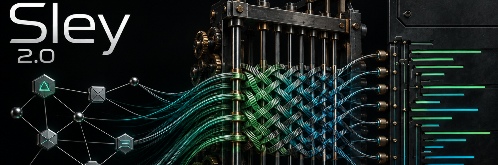
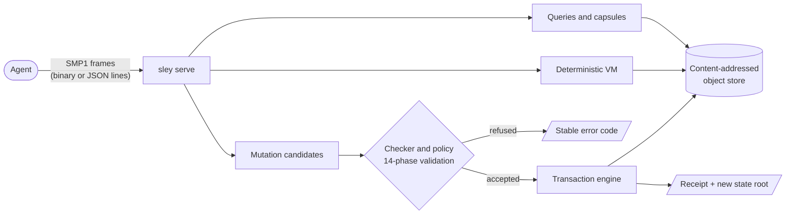

<p align="center">
  
</p>

<h3 align="center">Machine-native programming for AI agents.</h3>

<p align="center">
  Machines don't write source. They change verified program state.
</p>

<p align="center">
  <a href="https://sleylang.org"></a>
  
  <a href="LICENSE"></a>
  
  
  <a href="https://x.com/SleyLanguage"></a>
</p>

<p align="center">
  <a href="docs/QUICKSTART.md"><b>Quickstart</b></a> ·
  <a href="docs/CONCEPTS.md"><b>Concepts</b></a> ·
  <a href="https://sleylang.org/tutorial"><b>Walkthrough</b></a> ·
  <a href="docs/README.md"><b>Documentation</b></a> ·
  <a href="docs/release/SLEY-2.0.1.md"><b>Release notes</b></a> ·
  <a href="https://sleylang.org/faq"><b>FAQ</b></a>
</p>

---

## What is Sley?

Sley is a programming system built for AI agents rather than for people
typing into text editors. Sley programs aren't source files. A program is a
**typed, immutable semantic graph**: functions, types, blocks, operations,
contracts, and tests stored as content-addressed objects. An agent reads that
graph through bounded queries and changes it by proposing typed mutations. A
deterministic kernel checks every proposal before anything is committed.

```text
verified state ─▶ bounded query ─▶ proposed change ─▶ validation ─▶ atomic commit ─▶ new verified state
```

There's no parser to confuse, no formatting to fight over, and no "it
compiled on my machine". Every accepted state has an exact cryptographic
root. Every change carries a receipt. Every failure comes back as a stable
machine code instead of prose.

## Why Sley?

| When an agent writes source text… | With Sley… |
|---|---|
| It emits characters and hopes they parse. | It proposes **typed mutations** over a closed schema. Malformed input is rejected at the boundary. |
| Context means pasting whole files into a prompt. | Context is a **bounded, typed query** with explicit limits and no silent truncation. |
| "Is this valid?" depends on toolchains and flags. | One **deterministic kernel** judges types, control flow, effects, contracts, and policy the same way every time. |
| Identity is a file path and line number. | Identity is **content-addressed**: entities, objects, state roots, and transactions all have exact digests. |
| A half-applied edit can corrupt a tree. | Commits are **atomic**. After a crash you have either the old state or the complete new one. |
| Errors are paragraphs to interpret. | Errors are **stable numeric and symbolic codes** with exact contracts. |

## Quickstart

> **Requirements:** Linux x86_64. To build from source you also need the Rust
> toolchain pinned in [`rust-toolchain.toml`](rust-toolchain.toml) (1.93.0)
> and Python 3 for the demo.

**1. Get the `sley` binary.** Download `sley-2.0.1-linux-x86_64.tar.gz` from
[Releases](https://github.com/sley-lang/sley/releases), or build it from source:

```sh
git clone https://github.com/sley-lang/sley.git
cd sley
cargo build --release -p sley-cli        # → target/release/sley
```

**2. Say hello.** Every `sley` command prints machine-readable JSON:

```console
$ sley version
{"cli":"1","contract":"sley2-cli-v1","protocol_version":1}

$ sley hello --json
{"adapters":[],"effects":[],"features":{"cancel":true,"checksum":false,"json_bridge":false,"stream":true},
 "limits":{"max_depth":65535,"max_entities":65535,"max_frame_bytes":67108864,...},
 "methods":["session.open","workspace.create","query.root","candidate.create","commit","execute",...],
 "protocol_versions":[1],"schema_epochs":["a7fcf97a…"]}
```

`"json_bridge": false` is expected. `--json` is a transport choice of the
CLI, not a feature the endpoint negotiates
([SLEY_CLI_V1](docs/spec/SLEY_CLI_V1.md#2-serve) section 2).

**3. Run the end-to-end demo.** It imports a program into an empty repository,
queries it, executes a function, stores the report, creates a branch, exports
the repository, clones it into a second empty directory, and checks that the
clone gives byte-identical answers:

```console
$ python3 bench/release/run_demo.py --sley target/release/sley \
    --fixture conformance/release-demo/v1/demo.json
{
  "result": "PASS",
  "explicit_gap": "candidate construction, commit, test selection, and merge wait for the public candidate builder (S20-350 proposal-only)",
  "steps": {
    "query_root_matches_fixture": true,
    "execute_response_matches_fixture": true,
    "report_answers_stored_record": true,
    "branch_created": true,
    "exported_bytes": 9430,
    "clone_query_root_matches_fixture": true,
    "clone_execute_matches": true,
    ...
  }
}
```

From the release archive, run `python3 demo/run_demo.py` inside the unpacked
directory. No source tree is needed.

The demo imports and executes a program that was built in advance. As
`explicit_gap` says, it doesn't construct, commit, test-select, or merge a
candidate through the public builder, which is still proposal-only.

➡️ **The [full Quickstart](docs/QUICKSTART.md)** covers verifying the
download, driving `sley serve` by hand over JSON lines, exit codes, and the
full test gates.

## How it works



Sley has three canonical layers:

| Layer | What it is | Spec |
|---|---|---|
| **SSMC1**: Sley Semantic Machine Code | The only canonical program form: a typed, immutable graph of 18 entity kinds (`Function`, `Block`, `Operation`, `TypeDef`, `Contract`, `TestCase`, …). | [`docs/spec/SSMC1.md`](docs/spec/SSMC1.md) |
| **SCB1**: Sley Canonical Binary | The only canonical byte encoding. Strict and minimal. Malformed input is rejected, never normalized. BLAKE3 with domain-separated hashes. | [`docs/spec/SCB1.md`](docs/spec/SCB1.md) |
| **SMP1**: Sley Machine Protocol | The programming interface: versioned, bounded, cancellable request/response frames, with a JSON bridge for convenience. | [`docs/spec/SMP1.md`](docs/spec/SMP1.md) |

Read **[Concepts](docs/CONCEPTS.md)** for the full model: identities, state
roots, the change lifecycle, sessions, and the glossary.

## What's in 2.0

- **A deterministic semantic kernel.** Type system, control-flow and
  value-use validation, exact effect closure, contracts and tests, semantic
  fingerprints, and impact analysis.
- **A content-addressed repository.** An immutable object store, deterministic
  state roots, atomic transactions with receipts, native branches, semantic
  compare and merge (ambiguity becomes explicit conflict objects), repository
  exchange/clone, garbage collection, and crash recovery.
- **Agent-shaped context.** Root-backed typed queries and context capsules with
  hard limits. They fail loudly instead of truncating silently.
- **Proposal-first mutation.** Generated mutation descriptors for every entity
  kind and field. Candidates are validated in 14 ordered phases before any
  state moves.
- **A deterministic VM.** Bounded execution with fuel, output, and cancellation
  limits. It produces canonical observation digests and stored execution
  reports.
- **Policy and capabilities.** Protected policy roots, scoped capability
  tokens, and bounded adapters. There is no arbitrary shell.
- **A reproducible release.** Two clean musl builds compared member by member,
  a second-host attestation, CycloneDX and SPDX SBOMs, and recorded
  provenance.
- **Independent conformance.** A separate Python oracle reproduces the Rust
  kernel's bytes exactly, backed by persistent fuzz targets across ten
  surfaces.

See the **[2.0.0 release notes](docs/release/SLEY-2.0.0.md)** for the complete
list, including the known limits, and the
**[2.0.1 release notes](docs/release/SLEY-2.0.1.md)** for the fixes since.

## Project status

**Sley 2.0.1** is the current release, a patch release of 2.0.0. It's a
*release*, not a GA claim: the
[2.0.0 release notes](docs/release/SLEY-2.0.0.md#known-limits-and-what-is-not-yet-claimed)
list every acceptance criterion that wasn't met at 2.0.0 and every open
finding. 2.0.1 makes no new GA claim.

| Track | State |
|---|---|
| **Sley 2.0** | Released as 2.0.0, with fixes in 2.0.1. The kernel, repository, protocol, CLI, and reproducible packaging are in place. |
| **Sley 2.1** | In progress. **Self-hosting**: the Sley toolchain built with Sley, under the REWEAVE plan ([ADR-0049](docs/adr/ADR-0049-reweave-scope-adoption.md), [Bootstrap Profile 2](docs/spec/BOOTSTRAP_PROFILE_2.md)). |
| **Succession benchmark** | In progress. It measures agents working in Sley against raw source and Sley 1.x on a frozen 15-task corpus. Results will be published when the campaign finishes. |
| **Sley 1.x** | Frozen at [v1.2.0](https://github.com/GreyforgeLabs/sley-legacy/releases/tag/v1.2.0) in [GreyforgeLabs/sley-legacy](https://github.com/GreyforgeLabs/sley-legacy). It's a separate, human-readable language that is intentionally incompatible with 2.x. |

## Documentation

| Guide | What it covers |
|---|---|
| 🚀 **[Quickstart](docs/QUICKSTART.md)** | Install, verify, run the demo, and talk to `sley serve` by hand |
| 🧠 **[Concepts](docs/CONCEPTS.md)** | The mental model: SSMC1, SCB1, SMP1, identities, and the change lifecycle |
| 🧭 **[Architecture walkthrough](https://sleylang.org/tutorial)** | Step by step from verified state to proposal, validation, transaction, and new state |
| 📚 **[Documentation index](docs/README.md)** | Every specification, ADR, and reference, grouped by topic |
| 🏗️ **[Architecture](ARCHITECTURE.md)** | Crate authority, the dependency law, and the durability order |
| 📦 **[Release notes](docs/release/SLEY-2.0.0.md)** | What 2.0.0 contains, how to verify it, and what isn't claimed yet. [2.0.1](docs/release/SLEY-2.0.1.md) lists the fixes since. |
| 🔐 **[Security](SECURITY.md)** | Threat model, reporting, and the [threat register](docs/THREAT_REGISTER.md) |
| 🤝 **[Contributing](CONTRIBUTING.md)** | The slice contract, validation gates, and commit discipline |

## Build and test from source

These gates run from a fresh clone:

```sh
cargo build --release -p sley-cli     # the sley binary
cargo test --workspace --locked       # every crate's tests (about 15 to 20 minutes cold)
make conformance                      # Rust vs. the independent Python oracle (needs uv)
make adversarial                      # corruption, crash, and binding-confusion suites
make fuzz-smoke                       # bounded fuzz smoke across the codecs and importers
make lint                             # rustfmt check, plus clippy with all + pedantic denied
```

`make lint` rewrites the tracked `evidence/build/lint-report.json`, so it
leaves the tree dirty. Discard the record with
`git checkout -- evidence/build/lint-report.json` if you only wanted the check.

To reproduce the release artifact you need a clean tree at the release
commit, the `x86_64-unknown-linux-musl` target, and `uv`. If you ran
`make lint`, commit or discard its record first. On a fresh cargo cache, fetch
the locked dependencies before the build:

```sh
cargo fetch --locked
make release-candidate-smoke          # two clean musl builds + every release record, then verify
```

Maintainers run `make quick` as the routine gate. It doesn't pass on a fresh
clone: some of its checkers read the outputs of a local
`make release-candidate-build` under `evidence/runtime/`, which isn't tracked,
and two read the Sley 2.0 master goal, which lives outside the repository
(`SLEY2_MASTER_GOAL` points at it). The
[Quickstart](docs/QUICKSTART.md#6-run-the-test-gates) has the details.

The repository is a Cargo workspace of 20 crates under [`crates/`](crates/).
Each crate owns exactly one authority, from `sley-scb1` (canonical bytes) to
`sley-vm` (execution) and `sley-cli` (the thin wrapper). See
[ARCHITECTURE.md](ARCHITECTURE.md) for the dependency law.

## Community and links

| Where | Link |
|---|---|
| 🌐 **Website** | [sleylang.org](https://sleylang.org) |
| 📖 **Docs & walkthrough** | [sleylang.org/docs](https://sleylang.org/docs) · [sleylang.org/tutorial](https://sleylang.org/tutorial) · [sleylang.org/faq](https://sleylang.org/faq) |
| 🤖 **For LLMs** | [sleylang.org/llms.txt](https://sleylang.org/llms.txt) |
| 𝕏 **Sley on X** | [@SleyLanguage](https://x.com/SleyLanguage) |
| 𝕏 **Greyforge on X** | [@GreyforgeLabs](https://x.com/GreyforgeLabs) |
| 🔥 **Greyforge Labs** | [greyforge.tech](https://greyforge.tech) · [About](https://greyforge.tech/about) |
| 📰 **Background** | [The machine-native break](https://greyforge.tech/chronicles/sley-120-machine-native-break), on why Sley left source code behind |
| 🐙 **GitHub** | [sley-lang](https://github.com/sley-lang) · [GreyforgeLabs](https://github.com/GreyforgeLabs) |
| 🏛️ **Sley 1.x (legacy)** | [GreyforgeLabs/sley-legacy](https://github.com/GreyforgeLabs/sley-legacy) · [sleylang.org/legacy](https://sleylang.org/legacy) |

## License

Sley 2 is licensed under the [Apache License 2.0](LICENSE).
Copyright © 2026 [Greyforge Labs](https://greyforge.tech). See [NOTICE](NOTICE)
for details. Third-party dependency licenses are listed in the release SBOM,
and from 2.0.1 their texts ship in the release archive as
`THIRD_PARTY_LICENSES`.

<p align="center">
  <sub>Built by <a href="https://greyforge.tech">Greyforge Labs</a> · <a href="https://sleylang.org">sleylang.org</a> · <a href="https://x.com/SleyLanguage">@SleyLanguage</a></sub>
</p>
