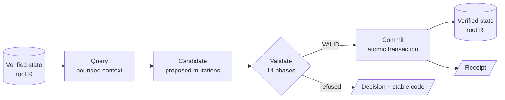

# Sley Concepts

This guide covers the mental model behind Sley 2: what a program *is*, how it
changes, and why each piece exists. It takes about fifteen minutes to read.
When you're ready to run something, go to the [Quickstart](QUICKSTART.md). For
exact rules, every section links to its normative spec.

**Contents**

- [The doctrine](#the-doctrine)
- [Programs are graphs, not text](#programs-are-graphs-not-text)
- [The three canonical layers](#the-three-canonical-layers)
- [Identity: five kinds of ID](#identity-five-kinds-of-id)
- [The change lifecycle](#the-change-lifecycle)
- [Context: queries and capsules](#context-queries-and-capsules)
- [Execution: the deterministic VM](#execution-the-deterministic-vm)
- [Repositories: branches, merge, exchange](#repositories-branches-merge-exchange)
- [Policy, capabilities, and effects](#policy-capabilities-and-effects)
- [Sessions and handles](#sessions-and-handles)
- [Errors are data](#errors-are-data)
- [What Sley deliberately doesn't have](#what-sley-deliberately-doesnt-have)
- [Glossary](#glossary)

---

## The doctrine

> **Machines do not write source. They mutate verified program state.**

Most languages were built for people typing into editors. When an AI agent
works in one of them, it produces *text* and hopes a parser, a type checker,
and a build system turn that text into the program it meant. Sley removes the
text entirely. The program is a typed data structure. The agent reads it
through bounded queries and changes it by proposing typed mutations. A
deterministic kernel decides whether each change is valid, and nothing else
gets a vote: not a model, not a reviewer, and not a heuristic.

Everything else in Sley follows from that one decision.

## Programs are graphs, not text

A Sley program is an **immutable semantic graph** of *entities*. SSMC1 defines
exactly 18 entity kinds:

| Group | Kind | Role |
|---|---|---|
| **Structure** | `Workspace` | The root of a program |
|  | `Package` | Membership, exports, dependencies |
|  | `Namespace` | Hierarchical membership |
|  | `DependencyBinding` | Binds an external root or package namespace |
| **Code** | `Function` | Signature, effects, contracts, and block graph |
|  | `Parameter` | A function or block parameter |
|  | `Block` | Ordered operations plus one terminator |
|  | `Operation` | A typed opcode and its declared results |
|  | `TypeDef` | A record or tagged-variant type |
|  | `Constant` | A persistable typed constant |
|  | `GlobalValue` | An immutable, explicitly referenced global |
| **Behavior and trust** | `EffectDef` | Request, response, failure, and scope types for an effect |
|  | `CapabilityRequirement` | A static effect or scope requirement |
|  | `Contract` | A typed predicate binding |
|  | `TestCase` | Inputs, expectations, observations, and ceilings |
|  | `AdapterImport` | A typed adapter ABI declaration |
|  | `EntryPoint` | An explicitly exposed callable function |
|  | `PolicyBinding` | Binds an entity to a requirement |

Functions are control-flow graphs of blocks. Blocks hold operations and end in
exactly one of five terminators. Every field is closed: unknown, missing,
duplicated, or ambiguous data fails. Human-friendly labels can be attached as
metadata, but they never become part of an entity's identity or semantics.

Spec: [SSMC1](spec/SSMC1.md) · [Type system](spec/TYPE_SYSTEM_V1.md) ·
[CFG validation](spec/CFG_VALIDATION_V1.md) · [Effect system](spec/EFFECT_SYSTEM_V1.md)

## The three canonical layers

```text
┌──────────────────────────────────────────────────────────────┐
│  SMP1: Sley Machine Protocol                                 │  how agents talk to Sley
│  versioned frames · sessions · bounds · cancellation         │
├──────────────────────────────────────────────────────────────┤
│  SSMC1: Sley Semantic Machine Code                           │  what a program is
│  18 entity kinds · types · CFG · effects · contracts · tests │
├──────────────────────────────────────────────────────────────┤
│  SCB1: Sley Canonical Binary                                 │  how it is stored
│  strict minimal encoding · BLAKE3 · domain-separated hashes  │
└──────────────────────────────────────────────────────────────┘
```

**SCB1** is the only canonical byte encoding. It is strict: every value has
exactly one valid encoding, and non-minimal or malformed bytes are *rejected*,
never normalized into something acceptable. That's what lets two
implementations agree on identity. An independent Python oracle in
[`oracle/`](../oracle/) reproduces the Rust kernel's bytes exactly, and the
conformance corpora check them against each other.

**SSMC1** is the only canonical program representation, built from SCB1
objects.

**SMP1** is the programming interface. It owns framing, version negotiation,
sessions, and bounded transport, and it owns *no semantics*. Every payload is
the frozen record of some subsystem's contract, and every judgment comes from
that subsystem's engine. A JSON bridge maps each frame to one JSON line for
convenience. The JSON form isn't canonical.

Spec: [SCB1](spec/SCB1.md) · [SSMC1](spec/SSMC1.md) · [SMP1](spec/SMP1.md) ·
[JSON bridge](spec/SMP1_JSON_BRIDGE_V1.md)

## Identity: five kinds of ID

Sley never identifies anything by file path or line number. Every identity is
exact and content-derived, and each hash is domain-separated so that two
different kinds of thing can never share an ID.

| ID | Identifies | Changes when… |
|---|---|---|
| `EntityId` | The *logical* entity, such as "this function" | Never. It is stable across versions. |
| `ObjectId` | One immutable version's canonical bytes | Any byte of that version changes |
| `StateRoot` | The complete semantic state of a program | Any entity changes. It ignores history: the same state has the same root however you got there. |
| `TransactionId` | One commit, bound to its parent | Always unique per commit, so it captures ancestry |
| `SchemaEpochId` | The rules used to decode and judge a state | The schema itself evolves (explicit migration only) |

Because the state root ignores history, two agents that reach the same
program by different routes get the same root, and a clone reproduces it
exactly.

Spec: [Identifiers](spec/IDENTIFIERS_V1.md) · [State root](spec/STATE_ROOT_V1.md) ·
[Schema epochs](spec/SCHEMA_EPOCH_V1.md)

## The change lifecycle

Every change to a Sley program follows the same path:



**1. Query.** The agent asks for exactly the context it needs (see
[below](#context-queries-and-capsules)).

**2. Propose.** The agent builds a **candidate**: an ordered list of typed
mutation operations over a specific base root. Mutations come from generated
descriptors, so every entity kind and every field has an exact, closed
mutation shape. Each operation can carry **preconditions** ("this entity is
still at version X"), which makes stale edits impossible to apply by
accident. A candidate only *proposes*. It can't grant itself authority or
change the rules it is judged by.

**3. Validate.** The kernel runs 14 ordered phases:

| # | Phase | # | Phase |
|--:|---|--:|---|
| 1 | Canonical frame | 8 | Effects |
| 2 | Schema and limits | 9 | Protected capability and policy |
| 3 | Stale base and preconditions | 10 | Contracts |
| 4 | Identity | 11 | Test planning |
| 5 | Graph and references | 12 | Resource analysis |
| 6 | Types | 13 | Candidate-root construction |
| 7 | Control flow | 14 | Final result digest |

A valid result has 14 passed phases. An invalid one has a passed prefix,
exactly one failed phase with a decision such as `TYPE_ERROR`, `STALE_ROOT`,
or `CAPABILITY_DENIED`, and a not-run suffix. Every phase records an evidence
digest, so a result is checkable and can't be forged.

**4. Commit.** The kernel **revalidates at commit time**, then stages
immutable objects, verifies them, promotes them, writes and syncs a receipt,
syncs directories, and only then compare-and-swaps the head. A crash at any
point leaves either the old state or the complete new state, never a partial
one. The whole sequence has a fault-injection matrix and an independent
checker.

**5. Receipt.** Every commit produces a canonical transaction and receipt that
bind the parent, the new root, and the validation evidence.

Spec: [Mutation schema](spec/MUTATION_SCHEMA_V1.md) ·
[Candidate record](spec/CANDIDATE_RECORD_V1.md) ·
[Preconditions](spec/PRECONDITION_PAYLOAD_V1.md) ·
[Validation result](spec/CANDIDATE_RESULT_V1.md) ·
[Transactions](spec/TRANSACTION_MODEL_V1.md) ·
[Crash recovery](spec/CRASH_RECOVERY_MATRIX_V1.md)

## Context: queries and capsules

Agents have finite context windows, so Sley treats context as a first-class,
*bounded* resource:

- **Root-backed queries** answer typed questions against a specific verified
  root, such as "the callers of this function" or "the signature of this
  entity". Each answer carries an exact query ID.
- **Hard limits, no silent truncation.** Every response reports what it
  returned, what it omitted, and whether it was truncated or has a
  continuation. A response that won't fit fails with
  `PROTOCOL_LIMIT_EXCEEDED`. Sley never quietly cuts it short.
- **Context capsules** package one query's answer as a deterministic evidence
  envelope: the question asked, the provenance, the omission status, and the
  facts arranged into ID dictionaries and edge tables.
- **Indexes are derived.** Reverse indexes and snapshots are rebuildable
  caches. They never grant authority, and they're checked for freshness
  against the root.

Spec: [Root-backed queries](spec/ROOT_BACKED_QUERY_PROFILE_V1.md) ·
[Context capsules](spec/CONTEXT_CAPSULE_PROFILE_V1.md) ·
[Entity reads](spec/ENTITY_READ_PROFILE_V2.md) ·
[Index snapshots](spec/COMPLETE_ROOT_INDEX_SNAPSHOT_PROFILE_V1.md)

## Execution: the deterministic VM

Sley programs run in a **deterministic VM**. The same state and inputs always
produce the same observations, byte for byte, on every machine. Functions are
lowered to bytecode and executed under explicit **fuel, value, output, and
cancellation limits**. Each run produces a canonical observation digest and a
stored **execution report** that you can read back later by its ID.

Bytecode and caches are derived state. They're keyed by root and profile and
can always be rebuilt.

Spec: [Execution model](spec/EXECUTION_MODEL_V1.md) ·
[VM lowering](spec/VM_LOWERING_PROFILE_V1.md) ·
[VM execution](spec/VM_EXECUTION_PROFILE_V1.md) ·
[Extended opcodes](spec/VM_EXTENDED_OPCODE_PROFILE_V1.md) ·
[Report envelopes](spec/REPORT_ENVELOPE_PROFILE_V1.md)

## Repositories: branches, merge, exchange

A Sley repository is a content-addressed object store plus refs, and it
doesn't depend on Git.

- **Branches** are atomic named refs. They advance by compare-and-swap from
  their direct parent.
- **Compare** diffs two states *semantically*: which entities changed and
  what they affect, not which lines.
- **Merge** is deterministic. Disjoint changes merge automatically. Ambiguous
  changes produce explicit **conflict objects**, never a guess.
- **Exchange** exports a repository to a single pack and imports it
  elsewhere. Import rebuilds exact roots and detects corruption before any
  ref moves.
- **GC** preserves every retained root. A dry run shows what would be
  collected.

Spec: [Repository model](spec/REPOSITORY_MODEL_V1.md) ·
[Refs and branches](spec/NATIVE_REFS_BRANCHES_V1.md) ·
[Semantic comparison](spec/SEMANTIC_COMPARISON_V1.md) · [Merge](spec/MERGE_V1.md) ·
[Exchange](spec/REPOSITORY_EXCHANGE_V1.md) · [GC](spec/GARBAGE_COLLECTION_V1.md)

## Policy, capabilities, and effects

A function's effects are part of its type. The checker computes their exact
closure, so an agent can't smuggle a side effect through a call chain. What a
program is *allowed* to do is decided separately:

- The **policy root** is protected and versioned apart from the program. A
  candidate binds the policy root it's judged under but can never modify it
  in the same transaction.
- **Capability tokens** are narrow, scoped grants bound to a root, an effect,
  a scope, an adapter, and a budget.
- **Adapters** are the only way out to the host. They're bounded and typed.
  There is no arbitrary shell.

Spec: [Policy root](spec/POLICY_ROOT_V1.md) ·
[Capability tokens](spec/CAPABILITY_TOKEN_V1.md) ·
[Effect system](spec/EFFECT_SYSTEM_V1.md) ·
[Reference adapters](spec/REFERENCE_ADAPTER_PROFILE_V1.md) ·
[Threat register](THREAT_REGISTER.md)

## Sessions and handles

An SMP1 conversation starts with a **hello** handshake that negotiates the
protocol version and profile. The handshake produces a deterministic identity,
and `session.open` exchanges it for a **session**. Inside a session, requests
are numbered, and short **handles** can stand in for long IDs. Handles are
bound to a root. After the head advances, a handle to the old root is *stale*
and fails with `SESSION_STALE_HANDLE`. It never silently resolves to some
other entity.

Spec: [Sessions and handles](spec/SESSION_HANDLE_PROFILE_V1.md) · [SMP1](spec/SMP1.md)

## Errors are data

Every failure in Sley has a **stable numeric code and a symbol**, such as
`20007 SSMC_OPCODE_UNKNOWN`, `33004 SESSION_STALE_HANDLE`, or
`43003 CLI_HANDSHAKE_REQUIRED`, along with its retryability. Codes are
grouped by owning subsystem and registered centrally, so an agent can branch
on them reliably. Prose never carries meaning.

Spec: [Error codes](spec/ERROR_CODES_V1.md)

## What Sley deliberately doesn't have

These omissions are constitutional, and they're enforced by tests
([anti-goals](ANTI_GOALS.md)):

- **No source syntax or parser**, and no canonical text format.
- **No formatter, REPL, Tree-sitter grammar, or conventional LSP.** There's
  no text to format or highlight.
- **No human-readability metric.** Programs are optimized for exactness, not
  for display.
- **No model or reviewer acting as the judge.** The deterministic kernel
  alone decides validity.
- **No self-authorizing candidates.** A change can't alter the rules it's
  judged by.
- **No arbitrary shell**, and no mandatory dependency on any Greyforge
  product.
- **No compatibility with Sley 1.x.** That lineage is frozen separately in
  [sley-legacy](https://github.com/GreyforgeLabs/sley-legacy).

## Glossary

| Term | Meaning |
|---|---|
| **Adapter** | A bounded, typed bridge between the VM and the host. The only way a program touches the outside world. |
| **Candidate** | A proposed change: ordered typed mutations over a base root, plus preconditions. Proposal only. |
| **Capsule** | A deterministic evidence envelope around one query's complete answer. |
| **Capability token** | A scoped, budgeted grant for an effect through an adapter. |
| **Conflict object** | The explicit result of an ambiguous merge. |
| **Entity** | A node of the program graph (18 kinds). Stable `EntityId`, versioned by `ObjectId`. |
| **Epoch** | A schema version (`SchemaEpochId`). Migration between epochs is explicit and preserves the old root. |
| **Handle** | A short, session-scoped, root-bound stand-in for an ID. Goes stale when the head advances. |
| **Oracle** | The independent Python implementation of SCB1 and the vectors, used to cross-check the Rust kernel. |
| **Policy root** | The protected, separately versioned set of rules a candidate is judged under. |
| **Receipt** | The canonical record of a committed transaction. |
| **REWEAVE** | The self-hosting plan: building the Sley toolchain with Sley. Targeted for 2.1. |
| **SCB1** | Sley Canonical Binary: the only canonical byte encoding. |
| **SMP1** | Sley Machine Protocol: the programming interface. |
| **SSMC1** | Sley Semantic Machine Code: the only canonical program form. |
| **State root** | The deterministic digest of a complete program state, independent of history. |
| **Succession** | The benchmark that measures agents working in Sley against raw source and Sley 1.x. |

---

Next: [Quickstart](QUICKSTART.md) · [Architecture walkthrough](https://sleylang.org/tutorial) ·
[Documentation index](README.md)
